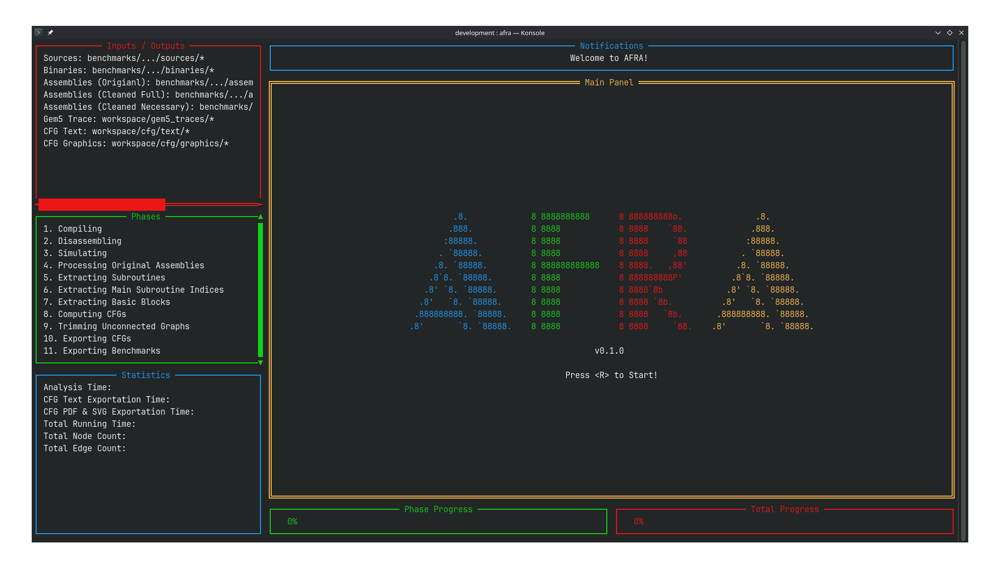
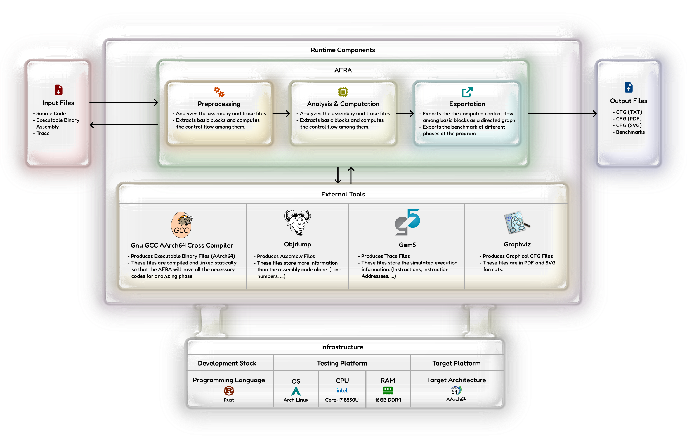

# AFRA
AFRA (ARM Flow Reconstruction and Analysis) is a control flow graph reconstructor for AArch64 binaries in basic block level.


## Overview
Afra isn't a standalone tool that does all the steps for CFG reconstruction. In fact it gets help from external tools for some secondary tasks:
- aarch64-linux-gnu-gcc: For compililng the C source codes to AArch64 binaries.
- aarch64-linux-gnu-objdump: For disassembling the AArch64 binaries.
- Gem5: For simulating the run of AArch64 binaries and producing trace information.
- Graphviz: For Constructing visual control flow graphs in PDF and SVG formats.



https://github.com/user-attachments/assets/68405acd-30db-485f-b4e3-e3584ce1e487

Written in Rust.
Tested on the following system:
- OS: Arch Linux
- CPU: Intel Core-i7 8550U
- RAM: 16 GB DDR4

## How to run?
### Prerequisites
- arch64-linux-gnu-gcc
- arch64-linux-gnu-objdump
- graphviz
### Setting up the environment
First clone the AFRA. In addition to afra directory, we need to place 3 necessary direcotories or files as follows:
1. **sources**
  - This is the directory that contains the programs C sources codes.
2. **gem5**
  - This is the gem5 directory that contains the necessary files for computer architecture simulation.
3. **gem5_arm_script.py**
  - This is the conifg file for gem5. It gives it some necessary information about the simulation like memory range, CPU architecture and more.

After cloning this repository, run the `setup_enivronment.sh` in the afra directory. When the setup completes, the afra directory in the current path will no longer exist. In fact, you'd end up with a directory hierarchy like this (toolchain is the sibling direcotry of the old afra directory):

- ~~afra (old)~~: This is where you ran the `setup_environment.sh` script.
- toolchain
  - benchmarks
    - default
      - **sources**
        - *.c
  - programs
    - **afra**
    - **gem5**
    - **gem5_arm_script.py**
  - workspace

Now put your C source codes in the **sources** directory as shown above.
### Run
After that navigate to the new afra directory in this hierarchy and then run the following command:
```sh
cargo run --release -- --source-path benchmarks/default/sources
```

### Running result
By running the AFRA and waiting for it to complete it's phases, you'd end up with a hierarchy like this:
- toolchain
  - benchmarks
    - default
      - assemblies
        - original
          - *.asm
        - processed
          - *.cf.asm
      - binaries
        - *.run
      - **sources**
        - *.c
  - programs
    - **afra**
    - **gem5**
    - **gem5_arm_script.py**
  - workspace
    - cfg
      - graphics
        - *.cfg.dot
        - *.cfg.pdf
        - *.cfg.svg
      - text
        - *.cfg.txt
    - gem5_traces
      - *.trace
    - m5out
    - benchmarks.bench.txt

And then you can examine the informations you need in the above directories.
